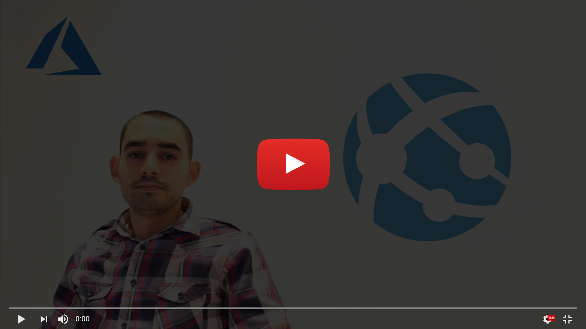
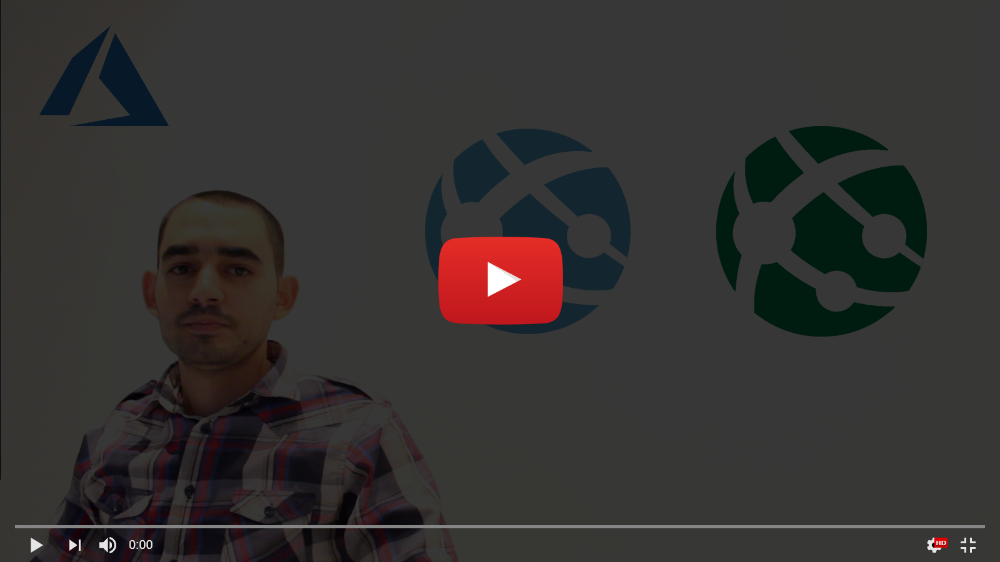
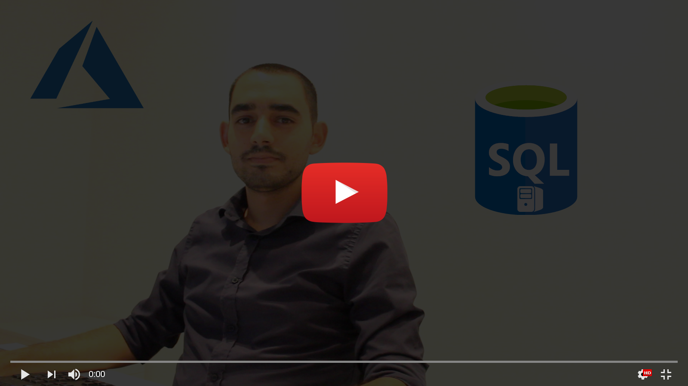
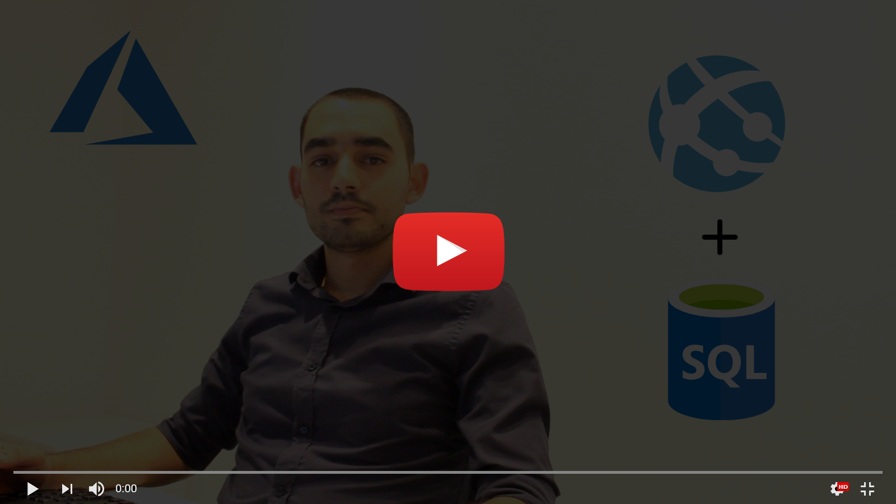
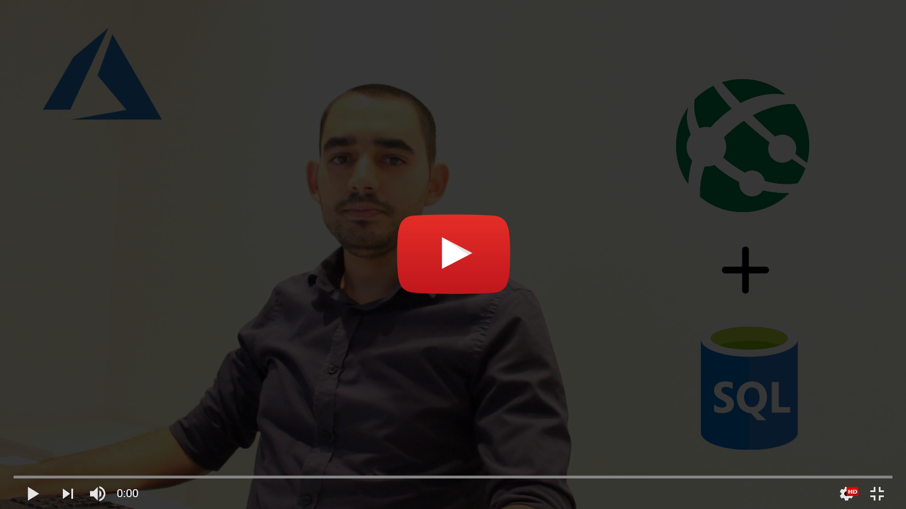
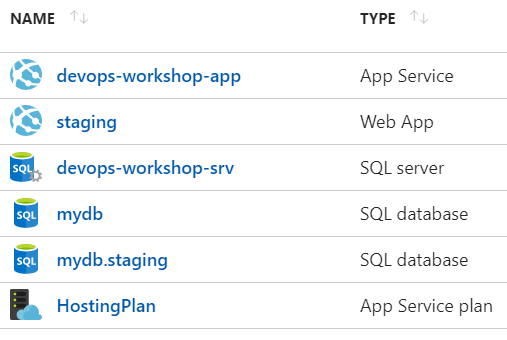

# Start from scratch - Basic : Azure
To start, we need to create the environment in Microsoft Azure.
Below are the steps :
### Step 1 : Create the Web App

### Step 2 : Create the Staging Environment (Slot)

### Step 3 : Create the Database

### Step 4 : Create the Staging Database

### Step 5 : Link the Database to the Web App

### Step 6 : Link the Staging Database to the Staging Environment (Slot)

Now, we have the environment in Microsoft Azure as follows :

