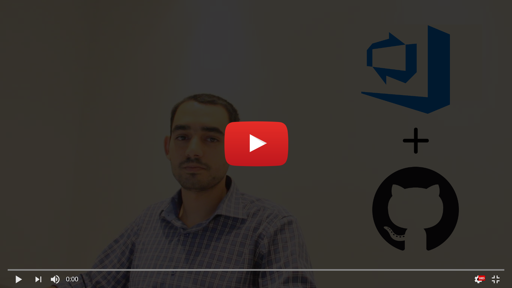

# Start from scratch - Basic : VSTS
### Step 1 : Create the project

### Step 2 : Import the repository from GitHub

### Step 3 : Create the build definition (Continuous Integration)

### Step 4 : Create the release definition (Continuous Deployment)